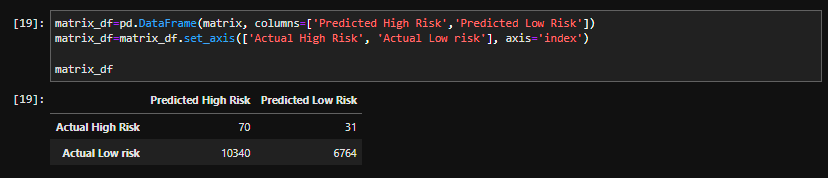
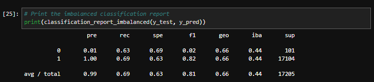
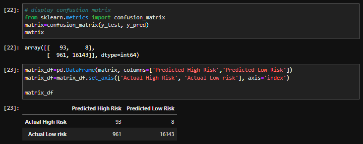

# Credit Risk Analysis
The purpose of this analysis was to apply various sampling algorithms and classifiers to determine which was best suited for predicting credit risk.
 

# Results

## Naive Random Oversampling
The first sampling method utilized was the `RandomOverSampler` algorithm from `imblearn.over_sampling` in conjunction with the `LogisticRegression` model. 

### *Balanced Accuracy Score*
The accuracy score of using `RandomOverSampler` with `LogisticRegression` was fairly low at only 65.8%. 

 

### *Confusion Matrix*
Looking at the confusion matrix, you can see that the model rarely misclassifies high risk applicants as low risk. Alternatively, the model very frequently misclassifies low risk applicants as high risk. 

The confusion matrix demonstrates why this model and sampling method is inadequate for predicting credit risk- while it may do well at preventing high risk applications from making it through, it also misclassifies the majority of low risk applications as high risk- which would lead to many qualified applications being denied. 

 

 

### *Imbalanced Classification Report*
Precision:
- **high risk**: at 0.01, the precision was very low
- **low risk**: at 1.0, the precision is high 

Recall:
- **high risk**: at 0.70, the precision was moderate
- **low risk**: at 0.61, the precision was low
   

 

### *Review*
Overall, the various metrics utilized to evaluate the use of `RandomOverSampler` with `LogisticRegression` indicate that this model *is not* suitable for predicting credit risk.

 
 

## Oversampling - SMOTE
The next sampling method utilized was the `SMOTE` algorithm from `imblearn.over_sampling` in conjunction with the `LogisticRegression` model. 

### *Balanced Accuracy Score*
The accuracy score of using `SMOTE` with `LogisticRegression` was similar to naive oversampling at just 66.2%. 

 

### *Confusion Matrix*
Looking at the confusion matrix, this sampling method decreased the amount of low risk applications that are misclassified as high risk. However, there were still over 5000 applications misclassified as high risk, which would again prevent qualified applicants from being approved.
 

 

### *Imbalanced Classification Report*
Precision:
- **high risk**: at 0.01, the precision was very low
- **low risk**: at 1.0, the precision is high 

Recall:
- **high risk**: at 0.63, the precision was low
- **low risk**: at 0.69, the precision was low
  

 

### *Review*
Overall, the various metrics utilized to evaluate the use of `SMOTE` with `LogisticRegression` indicate that this model, while slightly better than the previous, *is not* suitable for predicting credit risk.

 
 

## Undersampling - Cluster Centroids
The next sampling method utilized was the `ClusterCentroids` algorithm from `imblearn.under_sampling` in conjunction with the `LogisticRegression` model. 

### *Balanced Accuracy Score*
The accuracy score of using `ClusterCentroids` with `LogisticRegression` was lower than both oversampling methods, at just 54.5%- which is hardly better than random chance. 

 

### *Confusion Matrix*
Looking at the confusion matrix, this sampling method resulted in over 10,000 low risk applications being classified as high risk. It seems the model is highly biased toward classifying applications as high risk. 
 

 

### *Imbalanced Classification Report*
Precision:
- **high risk**: at 0.01, the precision was very low
- **low risk**: at 1.0, the precision is high 

Recall:
- **high risk**: at 0.69, the precision was low
- **low risk**: at 0.40, the precision was very low
  

 

### *Review*
Overall, the various metrics utilized to evaluate the use of `ClusterCentroids` undersampling with `LogisticRegression` indicate that this model performed even worse than our previous oversampling methods, and *is not* suitable for predicting credit risk.

 
 

## Combination Sampling - SMOTEENN
The next sampling method utilized was the `SMOTEENN` algorithm from `imblearn.combine` in conjunction with the `LogisticRegression` model. 

### *Balanced Accuracy Score*
The accuracy score of using `SMOTEENN` with `LogisticRegression` was better than all previous methods at 69.5%. While this is an improvement from the other models, it is still a fairly low score. 

 

### *Confusion Matrix*
Looking at the confusion matrix, this sampling method once again resulted in a large number of low risk applications being misclassified as high risk. Although, this model had the lowest number of high risk applications misclassified as low risk. This indicates the model is slightly more effective at preventing high risk applications from 'slipping through the cracks'. 
 

 

### *Imbalanced Classification Report*
Precision:
- **high risk**: at 0.01, the precision was very low
- **low risk**: at 1.0, the precision is high 

Recall:
- **high risk**: at 0.79, the precision was moderate
- **low risk**: at 0.60, the precision was low
  

 

### *Review*
Overall, the various metrics utilized to evaluate the use of `SMOTEENN` sampling with `LogisticRegression` indicate that this model performed slightly better than all previous models, but is still not very effective at predicting credit risk.

 
 

## Ensemble - Balanced Random Forest Classifier
The next sampling method utilized was the `BalancedRandomForestClassifier` algorithm from `imblearn.ensemble`. 

### *Balanced Accuracy Score*
The accuracy score of using `BalancedRandomForestClassifier` was higher than all previous models at 76.1%. This score is significantly better than the previous models. 

 

### *Confusion Matrix*
Looking at the confusion matrix, this sampling method once again resulted in a large number of low risk applications being misclassified as high risk. Although, this model had the lowest number of high risk applications misclassified as low risk. This indicates the model is slightly more effective at preventing high risk applications from 'slipping through the cracks'. 
 

 

### *Imbalanced Classification Report*
Precision:
- **high risk**: at 0.03, the precision was low
- **low risk**: at 1.0, the precision is high 

Recall:
- **high risk**: at 0.64, the precision was fairly low
- **low risk**: at 0.88, the precision is acceptable
  

 

### *Review*
Overall, the various metrics utilized to evaluate the use of `BalancedRandomForestClassifier` indicate that this model performed slightly better than all previous models, and is approaching a model with sufficient predictive power.

 
 

## Ensemble - Easy Ensemble Classifier
The next sampling method utilized was the `EasyEnsembleClassifier` algorithm from `imblearn.ensemble`. 

### *Balanced Accuracy Score*
The accuracy score of using `EasyEnsembleClassifier` was the highest performing model at 93.2%. 

 

### *Confusion Matrix*
Looking at the confusion matrix, this sampling method once again resulted in a large number of low risk applications being misclassified as high risk. Although, this model had the lowest number of high risk applications misclassified as low risk. This indicates the model is slightly more effective at preventing high risk applications from 'slipping through the cracks'. 
 

 

### *Imbalanced Classification Report*
Precision:
- **high risk**: at 0.09, the precision was low, but 9x better than all other models
- **low risk**: at 1.0, the precision is high 

Recall:
- **high risk**: at 0.92, the precision was high
- **low risk**: at 0.94, the precision was high
  

 

### *Review*
Overall, the various metrics utilized to evaluate the use of `EasyEnsembleClassifier` indicate that this model was the most effective at accurately predicting credit risk. 

# Summary & Suggestion
Based on all the models and sampling methods tested, use of the `EasyEnsembleClassifier` from `imblearn.ensemble` was by far the most effective at predicting credit risk. With an accuracy score of 93% and recall values in the 90+% range, this model is an acceptable model for this application.